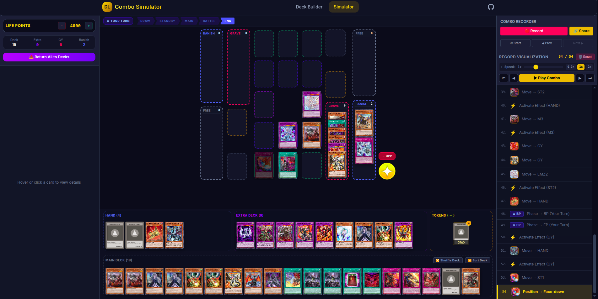
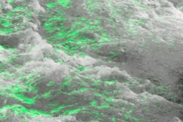
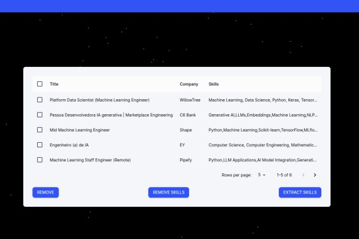

-   :fontawesome-solid-chess:{ .lg .middle .duel-links } __Duel Links Simulator__

    { align=left width=300 loading=lazy }

    A Yu-Gi-Oh! Duel Links simulator that allows players to simulate combos
    and test their decks. The simulator uses a custom-built engine to simulate
    the game mechanics and card interactions. It is 100% client-side and does
    not require any server-side processing.
    ---

    [:material-github: Repository](https://github.com/joseph-pq/yugioh-simulator)
    [:material-web: Duel-Links Simulator site](https://joseph-pq.github.io/yugioh-simulator/)

-   :fontawesome-solid-water:{ .lg .middle .river } __AWIVE__

    { align=left width=300 loading=lazy }

    Adaptive Water Image Velocimetry (AWIVE) is a novel technique for
    estimating the velocity of water in rivers and streams using image processing
    techniques such as Optical Tracking Velocimetry (OTV) and Space Time
    Image Velocimetry (STIV).
    ---

    [:material-github: Repository](https://github.com/joseph-pq/awive)
    [:material-web: AWIVE site](https://joseph-pq.github.io/awive/)

-   :sparkles:{ .lg .middle } __Skills Finder with LLM__

    { align=left width=300 loading=lazy }

    A web application that uses a Large Language Model (LLM) to find the current
    skills required trending in the job market. The application uses the Gemini
    AI API to extract the skills from job descriptions.
    ---

    [:material-github: Repository](https://github.com/joseph-pq/skills-finder)
    [:material-web: Skills-Finder site](https://joseph-pq.github.io/skills-finder/)

